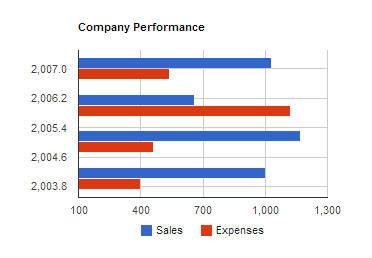

# Your First WebSharper Application in 2 Minutes 

This project contains the "Visualize data with any JS library" sample
from the [WebSharper website](http://websharper.com).

## Dependencies

This project requires WebSharper and WebSharper.Google.Visualization, and it is configured to fetch these dependencies automatically.

## About this project

You can recreate this project in Visual Studio, Xamarin Studio or CloudSharper by following these steps:

 1. Create a new WebSharper Single-Page Application project.
 2. Add a Nuget reference to `WebSharper.Google.Visualization`.
 3. Open `Client.fs` and replace its contents with the contents of `Client.fs` from this repository.
 4. Add an entry point "`

`" to `index.html` in the body tag before the `<script>` link.

Enjoy!
